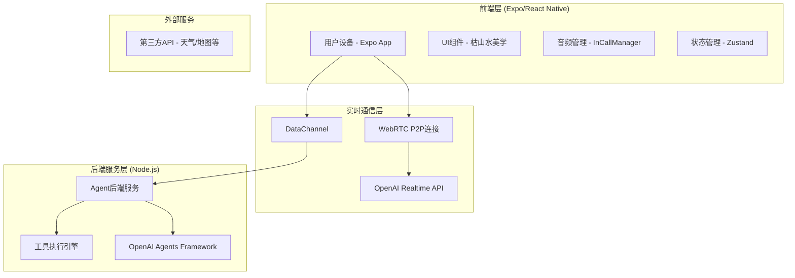
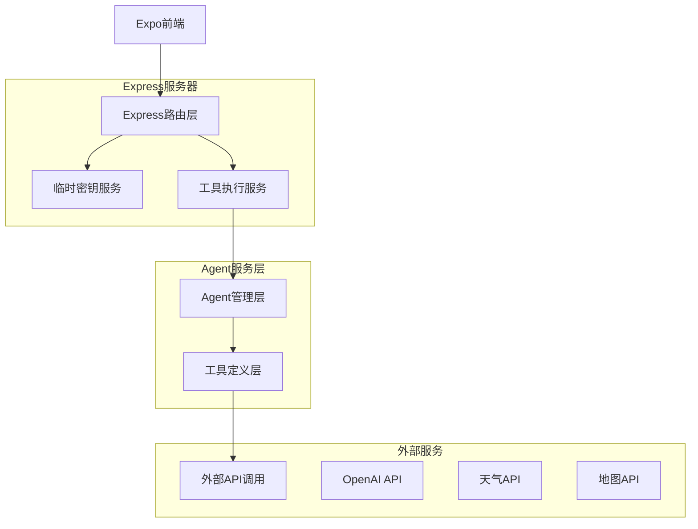

# kotoTHAI项目技术架构文档

## 1. 架构设计

### 1.1 整体架构图



### 1.2 Hybrid-Bridge架构特点

- **前端**: 保留Expo/React Native UI，负责用户交互和音频处理
- **WebRTC**: 直连OpenAI Realtime API，实现<1s低延迟语音交互
- **DataChannel**: 工具调用通过数据通道转发到后端处理
- **后端**: Node.js + openai-agents-js，处理复杂业务逻辑和工具调用

## 2. 技术描述

### 2.1 技术栈

- **前端**: Expo 53.0.4 + React Native 0.79.1 + TypeScript
- **UI框架**: NativeWind (Tailwind CSS) + 自定义设计系统
- **WebRTC**: react-native-webrtc + @config-plugins/react-native-webrtc
- **音频管理**: expo-av + react-native-incall-manager
- **状态管理**: Zustand + React Query
- **导航**: Expo Router
- **后端**: Node.js + Express + TypeScript
- **AI框架**: @openai/agents + @openai/agents-realtime
- **工具验证**: Zod

### 2.2 关键依赖版本

```json
{
  "前端核心依赖": {
    "expo": "~53.0.4",
    "react-native": "0.79.1",
    "react-native-webrtc": "^124.0.0",
    "@config-plugins/react-native-webrtc": "^8.0.0",
    "react-native-incall-manager": "^4.0.1",
    "expo-av": "~14.0.0"
  },
  "后端核心依赖": {
    "express": "^4.18.0",
    "@openai/agents": "latest",
    "@openai/agents-realtime": "latest",
    "zod": "^3.22.0",
    "cors": "^2.8.5"
  }
}
```

## 3. 路由定义

### 3.1 前端路由 (Expo Router)

| 路由 | 页面组件 | 功能描述 |
|------|----------|----------|
| `/` | WelcomeScreen | 欢迎页，复古明信片风格，应用介绍 |
| `/conversation` | ConversationScreen | 主对话界面，实时语音交互 |
| `/settings` | SettingsScreen | 设置页面，语言选择、音频配置 |
| `/call` | CallScreen | 通话界面，WebRTC连接状态显示 |

### 3.2 前端组件结构

```
/app/src/
├─ screens/
│   ├─ WelcomeScreen.tsx      // 欢迎页
│   ├─ ConversationScreen.tsx // 对话页
│   ├─ SettingsScreen.tsx     // 设置页
│   └─ CallScreen.tsx         // 通话页
├─ components/
│   ├─ ui/                    // 基础UI组件
│   ├─ conversation/          // 对话相关组件
│   └─ audio/                 // 音频控制组件
├─ realtime/
│   ├─ webrtc.ts             // WebRTC连接管理
│   ├─ agentBridge.ts        // Agent桥接
│   └─ audio.ts              // 音频处理
└─ stores/
    ├─ conversationStore.ts   // 对话状态
    └─ settingsStore.ts       // 设置状态
```

## 4. API定义

### 4.1 后端API端点

#### 4.1.1 临时密钥获取

```
POST /api/realtime/ephemeral
```

**功能**: 向OpenAI申请临时Realtime API密钥

**Request**: 无需参数

**Response**:
| 参数名 | 类型 | 描述 |
|--------|------|------|
| apiKey | string | 临时API密钥 |
| session | object | 会话配置信息 |

**示例**:
```json
{
  "apiKey": "sk-temp-xxx",
  "session": {
    "id": "session_xxx",
    "model": "gpt-4o-mini-realtime-preview-2024-12-17",
    "voice": "verse"
  }
}
```

#### 4.1.2 工具调用处理

```
POST /api/tool-call
```

**功能**: 处理从前端DataChannel转发的工具调用

**Request**:
| 参数名 | 类型 | 必需 | 描述 |
|--------|------|------|------|
| name | string | true | 工具名称 |
| args | object | true | 工具参数 |
| id | string | false | 调用ID |

**Response**:
| 参数名 | 类型 | 描述 |
|--------|------|------|
| ok | boolean | 执行状态 |
| result | any | 执行结果 |
| error | string | 错误信息（如有） |

**示例**:
```json
// Request
{
  "name": "get_weather",
  "args": { "city": "Tokyo" },
  "id": "call_123"
}

// Response
{
  "ok": true,
  "result": "Weather in Tokyo: sunny 25℃"
}
```

### 4.2 WebRTC数据通道协议

#### 4.2.1 工具调用事件

```json
{
  "type": "tool_call",
  "name": "get_weather",
  "arguments": { "city": "Tokyo" },
  "id": "call_123"
}
```

#### 4.2.2 工具结果事件

```json
{
  "type": "tool_result",
  "id": "call_123",
  "output": "Weather in Tokyo: sunny 25℃"
}
```

## 5. 服务器架构图



## 6. 数据模型

### 6.1 前端状态模型

#### 6.1.1 对话状态 (ConversationStore)

```typescript
interface ConversationState {
  // 连接状态
  connectionStatus: 'idle' | 'connecting' | 'connected' | 'disconnected';
  
  // 音频状态
  audioStatus: 'muted' | 'listening' | 'speaking' | 'processing';
  
  // 消息历史
  messages: Message[];
  
  // 当前会话
  currentSession?: RealtimeSession;
  
  // 错误状态
  error?: string;
}

interface Message {
  id: string;
  type: 'user' | 'assistant' | 'system';
  content: string;
  timestamp: number;
  audioUrl?: string;
}

interface RealtimeSession {
  id: string;
  apiKey: string;
  connection?: RealtimeConn;
}
```

#### 6.1.2 设置状态 (SettingsStore)

```typescript
interface SettingsState {
  // 语言设置
  sourceLanguage: 'zh' | 'ja' | 'en';
  targetLanguage: 'zh' | 'ja' | 'en';
  
  // 音频设置
  audioSettings: {
    speakerEnabled: boolean;
    microphoneEnabled: boolean;
    volume: number;
    voiceType: 'alloy' | 'echo' | 'fable' | 'onyx' | 'nova' | 'shimmer';
  };
  
  // UI设置
  uiSettings: {
    theme: 'light' | 'dark';
    fontSize: 'small' | 'medium' | 'large';
    animationsEnabled: boolean;
  };
}
```

### 6.2 后端数据模型

#### 6.2.1 Agent工具定义

```typescript
import { z } from 'zod';
import { tool, Agent } from '@openai/agents';

// 天气查询工具
export const getWeather = tool({
  name: 'get_weather',
  description: 'Get current weather information for a city',
  parameters: z.object({
    city: z.string().describe('City name'),
    country: z.string().optional().describe('Country code (optional)')
  }),
  async execute({ city, country }) {
    // 调用天气API
    const location = country ? `${city}, ${country}` : city;
    // TODO: 实际API调用
    return `Weather in ${location}: sunny 25℃, humidity 60%`;
  }
});

// 翻译工具
export const translateText = tool({
  name: 'translate_text',
  description: 'Translate text between languages',
  parameters: z.object({
    text: z.string(),
    from: z.enum(['zh', 'ja', 'en']),
    to: z.enum(['zh', 'ja', 'en'])
  }),
  async execute({ text, from, to }) {
    // TODO: 调用翻译API或使用内置翻译
    return `Translated from ${from} to ${to}: ${text}`;
  }
});

// kotoTHAI Agent定义
export const kotobaAgent = new Agent({
  name: 'kotoTHAI',
  instructions: `
    你是kotoTHAI，一个专业的中日英三语口译助手。
    
    核心原则：
    1. 提供准确、自然的翻译
    2. 保持礼貌和专业的语调
    3. 根据上下文调整翻译风格
    4. 必要时提供文化背景解释
    
    交互方式：
    - 简洁明了，避免冗长解释
    - 优先使用目标语言回复
    - 遇到歧义时主动询问澄清
  `,
  tools: [getWeather, translateText]
});
```

## 7. 部署架构

### 7.1 开发环境

```bash
# 前端开发
cd app
npx expo start --dev-client

# 后端开发
cd agent-server
npm run dev  # ts-node src/index.ts
```

### 7.2 生产环境

```bash
# 前端构建
cd app
npx expo build:ios
npx expo build:android

# 后端部署
cd agent-server
npm run build
npm start
```

### 7.3 环境配置

#### 7.3.1 前端环境变量 (.env)

```bash
EXPO_PUBLIC_API_BASE_URL=https://your-server.com
EXPO_PUBLIC_ENVIRONMENT=development
```

#### 7.3.2 后端环境变量 (.env)

```bash
OPENAI_API_KEY=sk-proj-xxx
PORT=8787
NODE_ENV=production
CORS_ORIGIN=*
```

## 8. 性能优化策略

### 8.1 前端优化

- **音频优化**: 使用InCallManager优化音频路由
- **WebRTC优化**: 配置STUN/TURN服务器确保连通性
- **UI优化**: 使用React.memo和useMemo减少重渲染
- **状态优化**: Zustand持久化关键状态

### 8.2 后端优化

- **连接池**: 复用HTTP连接
- **缓存策略**: Redis缓存频繁调用的API结果
- **负载均衡**: 多实例部署
- **监控告警**: 集成APM监控

### 8.3 网络优化

- **CDN加速**: 静态资源CDN分发
- **压缩传输**: Gzip压缩API响应
- **连接复用**: HTTP/2支持
- **回退机制**: WebRTC失败时回退到WebSocket

## 9. 安全考虑

### 9.1 API安全

- **密钥管理**: OpenAI API密钥服务端存储
- **临时密钥**: 使用ephemeral key限制前端权限
- **CORS配置**: 严格的跨域访问控制
- **请求限流**: 防止API滥用

### 9.2 数据安全

- **传输加密**: HTTPS/WSS加密传输
- **数据脱敏**: 敏感信息不记录日志
- **权限控制**: 最小权限原则
- **审计日志**: 关键操作审计

## 10. 监控与运维

### 10.1 关键指标

- **响应时间**: WebRTC首音延迟 <1s
- **成功率**: 连接成功率 >95%
- **错误率**: API调用错误率 <1%
- **用户体验**: 应用崩溃率 <0.1%

### 10.2 监控工具

- **前端**: Expo Analytics + Sentry
- **后端**: PM2 + Winston日志
- **基础设施**: Docker + 云监控
- **业务监控**: 自定义埋点统计